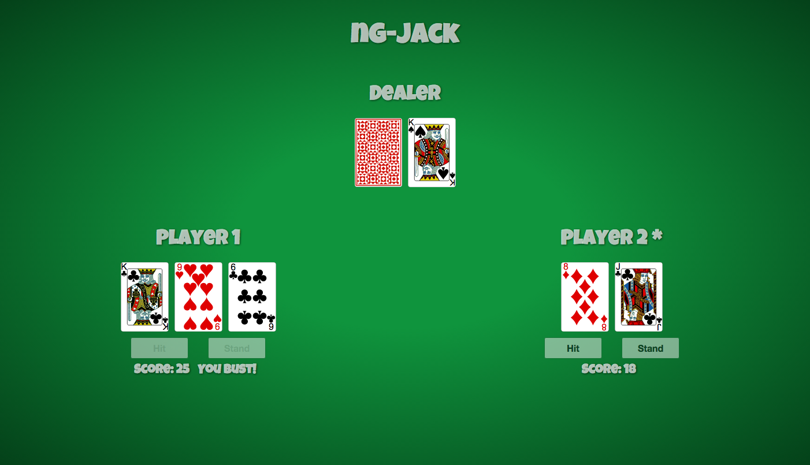

# ng-jack

A basic Blackjack game implementation, based on **Angular.js 1.4.x**

## Demo
[Click here to play the game!](https://ubenzer.github.io/ng-jack)

### To do
0. Establish a test infrastructure. (karma + mocha + should.js)
1. Write tests
2. Setup travis
3. Use gulp to automize tasks, dist mode, minify and concat files, enforce eslint etc.
4. Add some animations
5. Add sound effects to cards
6. Open a real gambling site :P

### Contributing
Just open an issue or create a pull request. You can pick one from the Todo list above.

### Credits
1. *Card set:* [Byron Knoll](http://www.byronknoll.com/projects.html)
2. *Card deck back:* [https://commons.wikimedia.org/wiki/File:Card_back_05a.svg](https://commons.wikimedia.org/wiki/File:Card_back_05a.svg)
4. *Font:* Luckiest Guy
